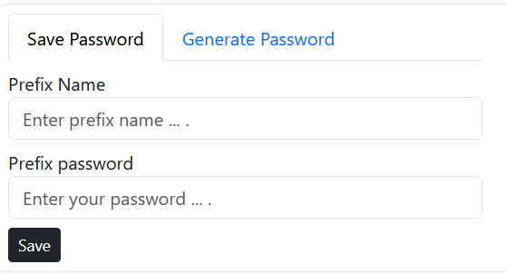

# Password Manager

A simple web-based Password Manager application built with HTML, CSS, and JavaScript. It allows users to save passwords with associated prefix names and generate random passwords of varying lengths.

## Installation

1. Clone the repository:

   ```bash
   git clone https://github.com/MALB1993/password-manager.git
   ```

2. Open `index.html` in your web browser.

## Usage

- Navigate between "Save Password" and "Generate Password" tabs to manage passwords.
- **Save Password Tab:**
  - Enter a prefix name and password, then click "Save" to store them locally.
  - Passwords are displayed in a table on the right.
  
- **Generate Password Tab:**
  - Enter a password length and click "Generate" to get a random password.
  - Click "Copy" to copy the generated password to your clipboard.

## Screenshots




## Contributing

Contributions are welcome! Fork the repository and submit a pull request with your enhancements.

## Credits

- Bootstrap: [Link](https://getbootstrap.com/)
- FontAwesome: [Link](https://fontawesome.com/)

## License

This project is licensed under the MIT License. See the [LICENSE](LICENSE) file for details.


### Notes:

- **Screenshots**: Replace `screenshots/save-password-tab.png` and `screenshots/generate-password-tab.png` with actual paths to your screenshots.
- **License**: Create a `LICENSE` file and specify the license text (e.g., MIT License).
- **GitHub Repository**: Make sure to push your code to your GitHub repository (`https://github.com/MALB1993/password-manager`).

This Markdown format allows for easy readability and copying into your GitHub repository's README.md file. Adjust the content as needed based on your specific implementation and preferences.